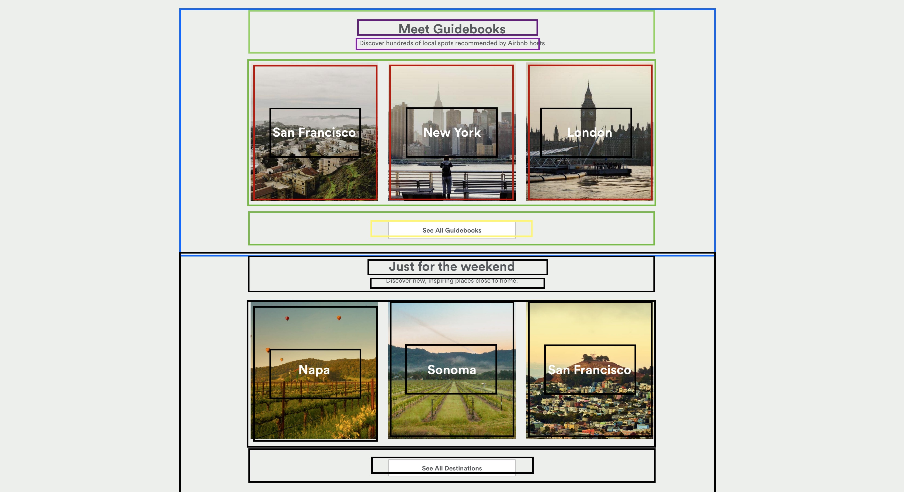

# Airbnb Mockup

Lots of websites, including Facebook and Airbnb, use a grid layout to display common elements, such as information cards, photos, and other information. The best way to learn how to create these different layouts is to try them ourselves. So let's try recreating a portion of Airbnb's website.

## Getting Started
* Fork and clone this repository to your computer
* A HTML file (`index.html`) and CSS file (`css/style.css`) have been created for you. Content is also provided in a folder called `img`

## Requirements
* Look at the deliverable screenshot and see how well you can match it.
* Keep the following in mind when recreating the screenshot
  * Obtaining and using relevant images
  * Aligning the text in the center of each image
  * Aligning the images in the center of each page
  * Think about rows and columns 
 

## Deliverable

Here's a screenshot of the portion that should be replicated. Deliver the mockup as close as possible. In addition, code should be well-indented and follow best practices, including no linter errors.

## Bonus

* After we study CSS Flexbox, refactor it!

---

## Licensing
1. All content is licensed under a CC-BY-NC-SA 4.0 license.
2. All software code is licensed under GNU GPLv3. For commercial use or alternative licensing, please contact legal@ga.co.